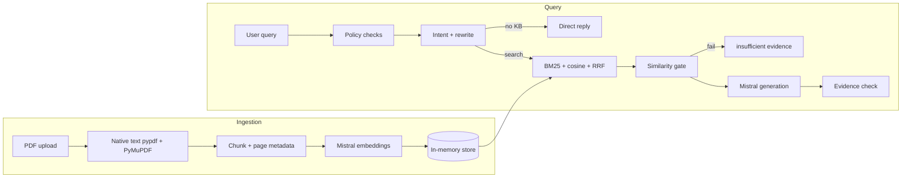

# PDF RAG pipeline (FastAPI + Mistral, no RAG/search libraries)

End-to-end retrieval-augmented generation over **uploaded PDFs**: custom **BM25** keyword search, **cosine similarity** on Mistral embeddings, **RRF fusion** and light re-ranking, then **Mistral chat** with intent-specific prompts. Includes a small **web UI**, citation metadata, similarity gating (“insufficient evidence”), heuristic **PII / legal / medical** policies, and a lexical **evidence check** on generated sentences.

> **Security:** Use `MISTRAL_API_KEY` in `.env` only. Never commit real keys. If a key was ever shared in chat or a ticket, **rotate it** in the [Mistral console](https://console.mistral.ai/).

## How it works



### Data ingestion

- **Endpoint:** `POST /ingest` — multipart form field `files` (one or more PDFs).
- **Extraction:** Per page, the longer of [pypdf](https://pypdf.readthedocs.io/) (plain + layout) and [PyMuPDF](https://pymupdf.readthedocs.io/) native text. There is **no OCR**; scanned image-only PDFs will not yield text unless you OCR them outside this app.
- **Chunking:** Sliding **character** windows with overlap, **per page** (citations stay page-accurate). Defaults target **fewer, larger** slices (`CHUNK_SIZE_CHARS=800`, `CHUNK_OVERLAP_CHARS=120`, ~200 tokens) to cut embedding cost and ingest time. **Trade-offs:** finer chunks (e.g. `400/80` or `80/20`) → better locality for pinpoint facts, but **more** Mistral embed calls and slower ingest; tune `RAG_SIMILARITY_THRESHOLD` if you change granularity.

### Query processing

1. **Policies** (`app/policies.py`): blocks obvious PII patterns and routes legal/medical wording to disclaimers (not a substitute for professional advice).
2. **Intent** (`app/intent_query.py`): fast path for greetings/thanks; otherwise one **Mistral** JSON call decides `needs_retrieval` and emits `retrieval_query_semantic` + `retrieval_query_keywords`.

### Semantic + keyword search (no search/RAG frameworks)

- **Keyword:** Hand-rolled **Okapi BM25** over a simple regex tokenizer and small stopword list (`app/bm25.py`, `app/tokenize.py`).
- **Semantic:** Query embedding from Mistral; **cosine similarity** vs stored chunk vectors (`app/semantic_rank.py`). Vectors are **L2-normalized** in memory.
- **Fusion:** **Reciprocal Rank Fusion** (`app/hybrid_search.py`) merges rankings; a small bonus rewards chunks that score well on **both** paths.
- **Optional multi-hop retrieval** (`RAG_MULTI_HOP_ENABLED=true`, `app/multi_hop.py`): after the first hybrid search, Mistral may emit a **follow-up query**; a **second** hybrid search runs, then results are **unioned** and re-ordered by **max** of (primary vs follow-up) cosine similarity and BM25.

### Post-processing

- **Re-rank:** RRF score + dual-signal bonus (see `hybrid_search`).
- **Optional cross-encoder re-rank:** Set `RAG_CROSS_ENCODER_ENABLED=true` and `pip install -r requirements-cross-encoder.txt`. The API pulls **`RAG_RETRIEVE_K`** candidates, scores **(query, passage)** pairs with [sentence-transformers](https://www.sbert.net/) `CrossEncoder`, then keeps **`RAG_TOP_K`**. Model: `CROSS_ENCODER_MODEL`.
- **Gate:** On the **first `RAG_TOP_K`** hybrid results (before cross-encoder). If the **best** semantic score is below `RAG_SIMILARITY_THRESHOLD`, or the **mean** is too low, returns **`insufficient evidence`**.

### Generation

- Mistral **chat completions** with templates switched by `intent` (`list` → bullets, `compare` → table-oriented instructions, `summary` → short bullets) in `app/generation.py`.
- **Hallucination / evidence filter:** After generation, sentences are checked for token **Jaccard overlap** with the retrieved context (`app/evidence.py`). Flagged sentences are listed in the API response and a caution is appended to the answer when needed.

### UI

- `static/index.html` — upload PDFs, chat via `POST /query`. Open `http://127.0.0.1:8000/` after starting the server.

## Run locally

```bash
python -m venv .venv
# Windows: .venv\Scripts\activate
# Unix: source .venv/bin/activate
pip install -r requirements.txt
# Optional cross-encoder: pip install -r requirements-cross-encoder.txt
copy .env.example .env   # or cp on Unix; set MISTRAL_API_KEY
uvicorn app.main:app --reload --host 127.0.0.1 --port 8000
```

- **API docs:** `http://127.0.0.1:8000/docs`
- **OpenAPI JSON:** `http://127.0.0.1:8000/openapi.json`

## API

| Method | Path | Description |
|--------|------|-------------|
| `POST` | `/ingest` | Multipart `files`: PDFs to index |
| `POST` | `/query` | JSON `{"query": "..."}` |

## Configuration (environment)

| Variable | Meaning |
|----------|---------|
| `MISTRAL_API_KEY` | Bearer token for [Mistral API](https://docs.mistral.ai/) |
| `MISTRAL_API_MAX_RETRIES` | Retries for chat/embed on **429** / **503** with backoff |
| `MISTRAL_API_RETRY_BASE_SECONDS` | Initial backoff (doubles each retry, capped ~60s) |
| `MISTRAL_EMBED_BATCH_SIZE` | Texts per embeddings request on ingest (smaller ⇒ gentler bursts) |
| `MISTRAL_EMBED_BATCH_DELAY_MS` | Pause between ingest embedding batches |
| `RAG_TOP_K` | Chunks passed to the model after fusion |
| `RAG_SIMILARITY_THRESHOLD` | Cosine gate (tune per corpus) |
| `RAG_RRF_K` | RRF constant (typical 60) |
| `UPLOAD_MAX_MB` | Max size per uploaded file |
| `CHUNK_SIZE_CHARS` | Target chunk length in characters (smaller ⇒ more chunks) |
| `CHUNK_OVERLAP_CHARS` | Overlap between consecutive windows on the same page |
| `RAG_CROSS_ENCODER_ENABLED` | Local cross-encoder re-rank after hybrid search |
| `RAG_RETRIEVE_K` | Candidate pool before re-rank (≥ `RAG_TOP_K`) |
| `CROSS_ENCODER_MODEL` | Hugging Face id for `CrossEncoder` |
| `RAG_MULTI_HOP_ENABLED` | Second retrieval hop with LLM-proposed query |
| `RAG_MULTI_HOP_POOL_K` | Candidates per hop before merge (≥ 8) |

## Libraries and services (links)

| Piece | Library / service |
|-------|-------------------|
| HTTP API | [FastAPI](https://fastapi.tiangolo.com/), [Uvicorn](https://www.uvicorn.org/) |
| HTTP client | [httpx](https://www.python-httpx.org/) |
| LLM + embeddings | [Mistral AI API](https://docs.mistral.ai/) (`/v1/chat/completions`, `/v1/embeddings`) |
| PDF text | [pypdf](https://pypdf.readthedocs.io/) + [PyMuPDF](https://pymupdf.readthedocs.io/) |
| Vectors / numerics | [NumPy](https://numpy.org/) |
| Cross-encoder (optional) | [sentence-transformers](https://www.sbert.net/) |
| Settings | [pydantic-settings](https://docs.pydantic.dev/latest/concepts/pydantic_settings/) |

**Explicitly not used:** LangChain, LlamaIndex, Haystack, vector DBs, hosted search (Elasticsearch, etc.), or BM25/semantic search packages — only first-party math and tokenization.

## Scalability notes

- **Today:** Single-process memory store; BM25 rebuilt on each query (fine for small corpora). Dense retrieval uses **FAISS HNSW** (inner product ≈ cosine on L2-normalized Mistral embeddings) when the chunk count ≥ `rag_ann_min_chunks`; below that threshold it stays exact for simplicity.
- **Next steps:** Shard embeddings across workers with a shared store, persist chunks + vectors (e.g. Parquet/SQLite blob) without adopting a *vector database product*, background embedding jobs, and optional incremental BM25.

## Project layout

```
app/
  main.py           # FastAPI routes
  pdf_ingest.py     # PDF → chunks
  chunk_store.py    # In-memory chunks + vectors
  vector_ann.py     # FAISS HNSW index (synced on ingest)
  bm25.py           # Sparse scoring
  semantic_rank.py  # Dense scoring
  hybrid_search.py  # RRF + re-rank
  intent_query.py   # Intent + query rewrite
  generation.py     # Prompt templates + Mistral chat
  evidence.py       # Post-hoc overlap check
  policies.py       # PII / domain refusals
  mistral_client.py # Thin API client
  attribution.py    # Per-document score rollups
  multi_hop.py      # Optional second retrieval hop
  cross_encoder_rerank.py # Optional CE re-rank
static/
  index.html        # Chat UI
```

## License

Use and modify as needed for your project.
