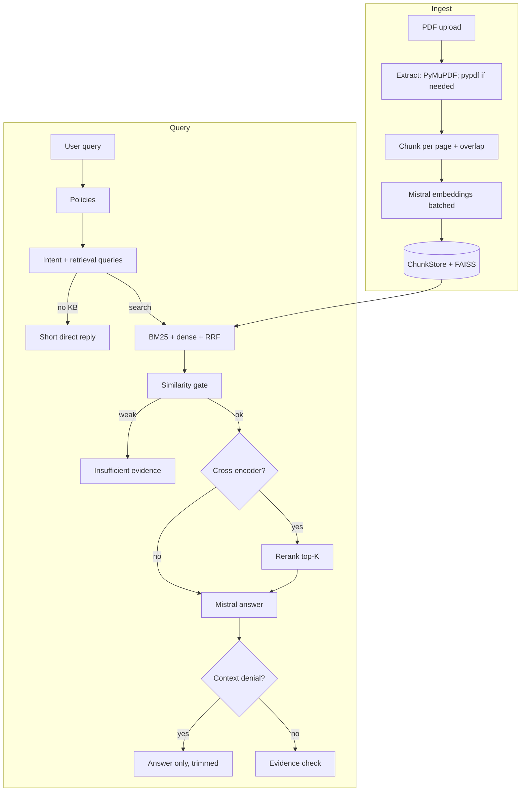

# PDF RAG pipeline

A **local FastAPI service** that ingests **PDFs**, indexes text chunks with **Mistral embeddings** and **hand-rolled BM25**, runs **hybrid retrieval** (dense + sparse + RRF), optionally **cross-encoder reranks** candidates, then answers with **Mistral chat** grounded in retrieved context (no structured citation payloads in the API). A small **static UI** talks to `POST /ingest` and `POST /query`.

**Design goal:** end-to-end RAG **without** LangChain, LlamaIndex, Elasticsearch, or a hosted vector database—**custom** tokenization, BM25 math, fusion, and policies—with **faiss-cpu** only for **approximate** dense search at scale and **sentence-transformers** for optional second-stage reranking.

> **Security:** Keep `MISTRAL_API_KEY` in `.env` only. Never commit real keys. Rotate keys in the [Mistral console](https://console.mistral.ai/) if exposed.

---

## What it does (short)

| Stage | Behavior |
|--------|----------|
| **Ingest** | PDF → native text (PyMuPDF + optional pypdf) → per-page character chunks → Mistral **embeddings** → in-memory store + **FAISS HNSW** index (row `i` = chunk `i`). Response includes **timings** (extract vs embed). |
| **Query** | Policy screen → **intent** + query rewrites (Mistral JSON) → **hybrid search** (BM25 + dense, RRF) → **similarity gate** → optional **cross-encoder** rerank → **generation** → if the model says the PDFs don’t contain the answer, **irrelevant trailing text is trimmed**; else **Jaccard evidence check** on the answer. |

---

## Architecture



---

## Ingestion (`POST /ingest`)

- **Multipart** field `files`: one or more PDFs (see `upload_max_mb`).
- **Text extraction:** PyMuPDF `get_text` first. With **`PDF_EXTRACT_FAST`**, pypdf is **skipped** when PyMuPDF already returns enough characters; otherwise pypdf is used (plain only in fast mode, plain+layout when fast is off). **No OCR**—image-only PDFs yield no text unless you OCR elsewhere.
- **Chunking:** Sliding windows **per page** with overlap so `page_start` / `page_end` stay page-accurate. Defaults: `CHUNK_SIZE_CHARS` / `CHUNK_OVERLAP_CHARS` (see `.env.example`).
- **Embeddings:** Mistral `/v1/embeddings` in batches (`MISTRAL_EMBED_BATCH_SIZE`); total tokens per request are capped by Mistral—reduce batch size or chunk length if you see **400 / code 3210**.
- **Response:** `chunks_added`, `message`, and **`timings`**: `pdf_extract_and_chunk_s` vs `embedding_s` (UI shows both).

---

## Query (`POST /query`)

1. **`policies`** — Regex / keyword blocks (e.g. PII patterns); can return a fixed disclaimer for legal/medical-style prompts.
2. **`intent_query`** — One Mistral call returns JSON: skip retrieval for chit-chat, or `retrieval_query_semantic` + `retrieval_query_keywords` for search.
3. **Hybrid retrieval** (`hybrid_search`): rebuild BM25 over all chunks; embed the semantic query; **dense** scores use **exact cosine** for small corpora or **FAISS HNSW** (inner product on L2-normalized vectors) when `rag_ann_min_chunks` is exceeded; **RRF** fuses BM25 and dense rankings with a small dual-signal bonus.
4. **Gate:** If the top fused hits are below **`RAG_SIMILARITY_THRESHOLD`** (best and mean checks), respond with **insufficient evidence** and no generation.
5. **Cross-encoder** (default): score **(query, passage)** pairs locally; reorder to **`RAG_TOP_K`** (`cross_encoder_rerank.py`).
6. **Generation:** Intent-shaped prompts (`generation.py`); plain-language answers without filename/page citations in the API response.
7. **Context denial:** If the reply indicates the PDFs don’t cover the question, **trailing source-style junk may be trimmed** so unrelated questions don’t show random retrieved text.
8. **Evidence check:** Token Jaccard of answer sentences vs context (`evidence.py`); weak overlap adds a caution note (not on pure “not in context” replies).

**API responses** include `answer`, `insufficient_evidence`, `policy_flags`, `hallucination_flags`, and optional `debug`.

---

## Run locally

```bash
python -m venv .venv
# Windows: .venv\Scripts\activate
# Unix: source .venv/bin/activate
pip install -r requirements.txt
copy .env.example .env   # or cp on Unix; set MISTRAL_API_KEY
uvicorn app.main:app --reload --host 127.0.0.1 --port 8000
```

- **UI:** `http://127.0.0.1:8000/`
- **Swagger:** `http://127.0.0.1:8000/docs`

---

## API

| Method | Path | Description |
|--------|------|---------------|
| `POST` | `/ingest` | Multipart `files`: PDFs to index |
| `POST` | `/query` | JSON `{"query": "..."}` |

---

## Configuration (environment)

| Variable | Meaning |
|----------|---------|
| `MISTRAL_API_KEY` | Bearer token for [Mistral API](https://docs.mistral.ai/) |
| `MISTRAL_EMBED_BATCH_SIZE` | Chunk texts per embeddings request (watch total token limit) |
| `MISTRAL_EMBED_BATCH_DELAY_MS` | Pause between embedding batches on ingest |
| `PDF_EXTRACT_FAST` | Skip pypdf when PyMuPDF text is long enough |
| `PDF_FITZ_MIN_CHARS_SKIP_PYPDF` | Min PyMuPDF length to skip pypdf on a page |
| `CHUNK_SIZE_CHARS` / `CHUNK_OVERLAP_CHARS` | Per-page windowing |
| `RAG_TOP_K` | Chunks sent to the chat model after fusion / rerank |
| `RAG_RETRIEVE_K` | Pool size before cross-encoder (≥ `RAG_TOP_K` when CE on) |
| `RAG_SIMILARITY_THRESHOLD` | Semantic gate on fused top hits |
| `RAG_RRF_K` | RRF smoothing constant (often ~60) |
| `RAG_CROSS_ENCODER_ENABLED` | Local cross-encoder rerank |
| `CROSS_ENCODER_MODEL` | Hugging Face id for `CrossEncoder` |
| `RAG_ANN_ENABLED` | Use FAISS HNSW for dense scores when corpus is large |
| `RAG_ANN_MIN_CHUNKS` | Use exact cosine below this count |
| `RAG_ANN_NEIGHBORS` | FAISS `k` (should be ≥ retrieve pool) |
| `UPLOAD_MAX_MB` | Max size per uploaded PDF |
| `EVIDENCE_OVERLAP_MIN` | Min sentence–context Jaccard to skip a weak-overlap flag (**lower** = fewer flags) |

---

## Libraries and services

| Piece | Technology |
|-------|------------|
| API | [FastAPI](https://fastapi.tiangolo.com/), [Uvicorn](https://www.uvicorn.org/) |
| HTTP | [httpx](https://www.python-httpx.org/) |
| LLM + embeddings | [Mistral AI](https://docs.mistral.ai/) |
| PDFs | [pypdf](https://pypdf.readthedocs.io/), [PyMuPDF](https://pymupdf.readthedocs.io/) |
| Dense ANN | [faiss-cpu](https://github.com/facebookresearch/faiss) (HNSW + inner product) |
| Cross-encoder | [sentence-transformers](https://www.sbert.net/) |
| Numerics | [NumPy](https://numpy.org/) |
| Settings | [pydantic-settings](https://docs.pydantic.dev/latest/concepts/pydantic_settings/) |

**Not used as frameworks:** LangChain, LlamaIndex, Haystack, Elasticsearch/OpenSearch, or vendor “RAG” SDKs. BM25 and hybrid fusion are **implemented in this repo**.

---

## Scalability notes

- **Today:** Single-process **in-memory** store; BM25 is **rebuilt every query**; FAISS lives in-process and stays aligned with chunk order on ingest.
- **Limits:** No persistence across restarts; Mistral token caps bound embedding batch size; cross-encoder runs **locally** (CPU/GPU via PyTorch).

---

## Project layout

```
app/
  main.py              # Routes, ingest/query orchestration
  pdf_ingest.py        # PDF → pages → chunks
  chunk_store.py       # In-memory chunks + normalized vectors
  vector_ann.py        # FAISS HNSW (synced on ingest)
  bm25.py              # Okapi BM25
  semantic_rank.py     # Dense scores (exact + FAISS path)
  hybrid_search.py     # RRF fusion
  intent_query.py      # Intent + query rewrites
  cross_encoder_rerank.py
  generation.py        # Prompts + context-denial helpers
  evidence.py          # Lexical overlap check
  policies.py          # Safety / domain routing
  mistral_client.py    # Chat + embeddings + retries
static/
  index.html           # Upload + chat UI
```

---

## License

Use and modify as needed for your project.
